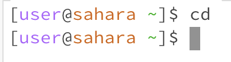

# Lab Report 1

In this lab we learned how to create a workspace, use commands in the workspace, create a github page, and use Markdown. I will now analyze the cd, ls, and cat command to see how they work with different types of arguments.

# cd
## No Argument

