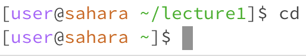
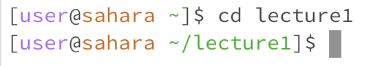
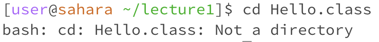
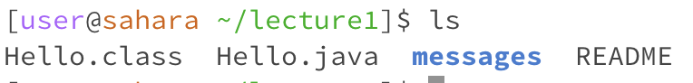
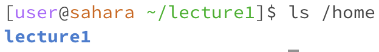
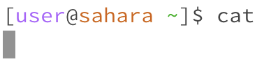
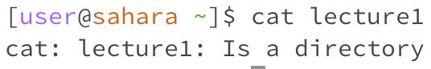
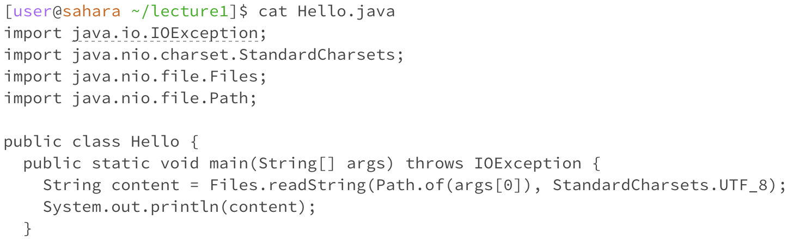

# Lab Report 1

In this lab we learned how to create a workspace, use commands in the workspace, create a github page, and use Markdown. I will now analyze the cd, ls, and cat command to see how they work with different types of arguments.    

# cd
## No Argument

  

Working directory: /home
Here I used cd with no argument and nothing happened. That is because I didn't give it any directory to change to.
No Error

  

Working directory: /home/lecture1
When I do it here with no argument it does actually switch directorys. This is becasue I was originally in the lecture1 directory, and when you do cd with no argument it changes to the home.
No Error

## Directory As Argument

Working Directory: /home
Here I used the lecture1 directory as the argument and as you can see it changed the working directory to be lecture1. 
No Error

## File As Argument

Working Directory: /home/lecture1
Here I used the Hello.class file as the argument and recevied back this Error.
Error: This was an eror because you can't use a file as an argument for cd. This is because it needs a directory to change to, and files can't work as directorys as they can't hold any other content such as more files or directorys.

# ls 
## No Argument

Working Directory: /home/lecture1
Here I used ls with no arguments and it did its job and showed me all of the contents of the working directory I was in which was lecture1.
No Error

## Directory As Argument

Working Directory: /home/lecture1
Here I used the home directory as the argument and got the contents of the home directory, which is just the lecture1 directory. It doesn't change your working directory, just shows the contents of whichever one you specify.
No Error

## File As Argument

Working Directory: /home/lecture1
Here I used the Hello.class file as the argument and recevied back Hello.class. This is because ls shows the contents of a directory, and when given a single file there isn't any other content to list other than the file itself. If we want to print the contents of a file we should use cat instead.
No Error

# cat
## No Argument

Working Directory: /home
Here I used cat with no argument which caused an error and led to the code to keep running with no resolution until I force stopped it. 
Error: This is because cat needs a file to read and print the contents of and without a file to read it doesn't know what to do.

## Directory As Argument

Working Directory: /home
Here I used the lecture1 directory as the argument and receieved back an error message saying that lecture1 is a directory. 
Error: This is because cat can only be used to print the contents of files, if we want to print the contents of a directory we should use ls.

## File As Argument

Working Directory: /home/lecture1
Here I used the Hello.java file as the argument which led to the text of Hello.java to be printed out. This is useful when needing to read a file while in the terminal, or to see what you need to edit.
No Error
