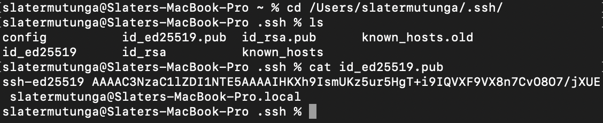
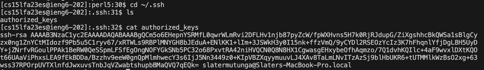

# Lab Report 2

In this lab we created a Java program called StringServer which adds strings to a list and outputs the strings.

## StringServer Code

## Using AddMessage 

The method that gets called is handleRequest(); 

It takes the url as an URI variable which is set to the name url. At the time of this, the ArrayList strings is empty.

After running through the code it checks to see if /add-message is in the url, if it is it takes everything after the query ?s= and puts that string into the ArrayList strings. It then creates a StringBuilder, named list, goes through all of the strings in the ArrayList strings, adds them to the StringBuilder along with being numbered, and then returns it as a string.

The only fields that was permanetly changed was the ArrayList strings which now holds the string, "Hello". The StringBuilder list was also created and changed, but it is recreated everytime a new message is added so it won't impact future usage. 

## Using AddMessage Again

The method that gets called is handleRequest(); 

It takes the url as an URI variable which is set to the name url. At the time of this, the ArrayList strings holds the string, "Hello".

After running through the code it checks to see if /add-message is in the url, if it is it takes everything after the query ?s= and puts that string into the ArrayList strings. It then creates a StringBuilder, named list, goes through all of the strings in the ArrayList strings, adds them to the StringBuilder along with being numbered, and then returns it as a string.

The only field that was permanently changed was the ArrayList strings which now holds the strings, "Hello" and "How are you". The StringBuilder list was also created and changed, but it is recreated everytime a new message is added so it won't impact future usage. 

## Path's To Keys

This is the ssh key that is on my computer under /Users/slatermutunga/.ssh/id_rsa.pub

This is the ssh key that is in my ieng6 account under /.ssh/authorized_keys

