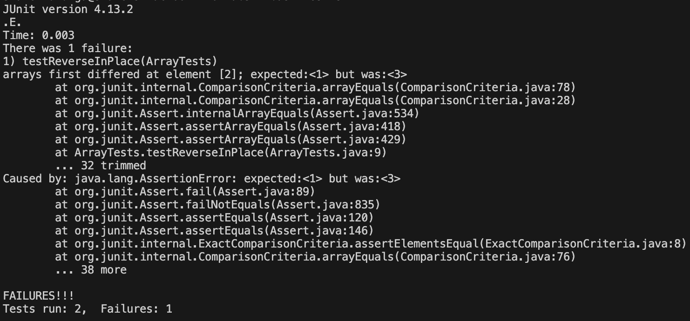
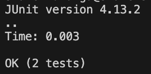

# Lab Report 3

## Failure Inducing Input

```
  public void testReverseInPlace() {
    int[] input1 = {1, 2, 3};
    ArrayExamples.reverseInPlace(input1);
    assertArrayEquals(new int[]{ 3, 2, 1 }, input1);
	}
```

## Non Failure Inducing Input

```
    public void testReverseInPlace() {
      int[] input1 = {1, 2, 1};
      ArrayExamples.reverseInPlace(input1);
      assertArrayEquals(new int[]{ 1, 2, 1 }, input1);
  	}
```

## Symptom JUnit Tests

## Test 1



## Test 2 


## Fixing Bug

## Original Code

```
    static void reverseInPlace(int[] arr) {
    	for(int i = 0; i < arr.length; i += 1) {
         	arr[i] = arr[arr.length - i - 1];
        }
    }
```

## Fixed Code
```
 static void reverseInPlace(int[] arr) {
    int l = arr.length;
    int[] reversedArray = new int[l];
    for(int i = 0; i < arr.length; i += 1) {
	     reversedArray[i] = arr[l - i - 1];
    }
    
    for(int i = 0; i < arr.length; i++){
             arr[i] = reversedArray[i];
    }
}
```

This fixes the issue as initialiy it doesn't use two arrays. This is neccessary because in the original code it would rewrite the values in arr[i] before getting to read ones needed. For example 
arr[0] would get changed to hold arr[2] in the first run of the for loop. Then when you want to put arr[0] into arr[2] its the wrong value. By changing it so there is another array you can use it to hold
all of the values in arr in reversed order, and then use another for loop to put the reversed values into arr, in the correct order.

