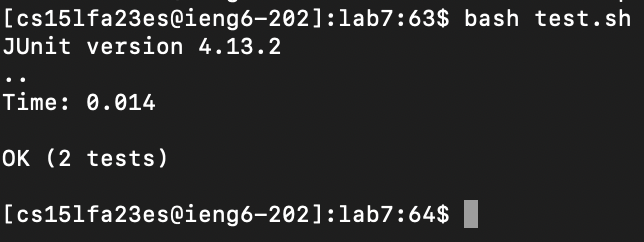

# Lab Report 4

## Step 4


```
Keys Pressed: ssh<space>cs15lfa23es@ieng6.ucsd.edu<enter>
```

The first step is to sign into our ieng6 account and we do this by using ssh and our ieng6 email.

## Step 5


```
Keys Pressed: git<space>clone<space>git@github.com:slatermutunga/lab7.git<enter>
```

In this step we need to clone the lab7 repository to our ieng6 account, we do this by using the git clone command.
We need to do this in order to work on the lab7 folder. We also used the ssh link from our github fork so we will be able to
commit changes to it.

## Step 6


```
Keys Pressed: cd<space>lab7<enter>, bash<space>test.sh<enter>
```

In this step we need to test the merge function which contains an error we need to fix. First we need to move into the lab7 directory
which we do by using the cd command. Then we need to run the tests so we use the bash command, with the test.sh script which is set up to
test the merge function. After running this we see that there was a failure in testMerge2.

## Step 7


```
Keys Pressed: vi<space>ListExamples.java<enter>, <shift + G><up><up><up><up><up><up><right><right><right><right><right><right><right><right>
<right><right><right><right>i<backspace>2<escape>:wq
```

In this step we want to switch line 44 of ListExamples.java so it says "index2" instead of "index1." To do this first we need to get into the 
file with vim which we do by using the command vi, and using it on ListExamples.java. After were in the file I used the G command to jump to the 
bottom of the file as its closer to there, then you go up 6 and to the right 12 times to get to the right spot, then you use the i command in order to
get into edit mode, use backspace to delete the 1, and then putting a 2. At this point were done so we use the esape command to get out of edit mode,
and then use the :wq command in order to save the file.

## Step 8



```
Keys Pressed: bash<space>test.sh<enter>
```

In this step we want to run the test script again in order to see if our change fixed the program, after using the bash command on the test.sh script
for the second time we see that this time both tests passed which shows we fixed the error.

## Step 9


```
Keys Pressed: git<space>add<space>--all<enter>, git<space>commit<space>-m<space>"edited<space>files"<enter>, git<space>push<enter>
```

In this step we want to commit our changes we made in Step 7 to our github repository. We do this by first using the git add --all command which adds all 
of the changes to the staging directory. Then the git commit command creates a snapshot of the changes we added in the last command. And then the last command 
is git push which sends the changes from our local repository to our github repository. Now when we go on github we can see that the ListExamples.java has been updated
there as well.
