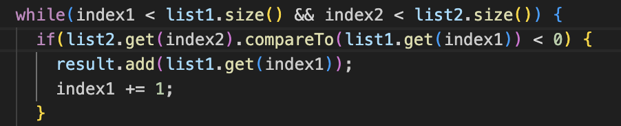
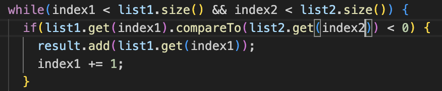
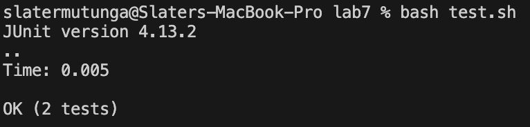
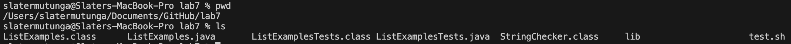
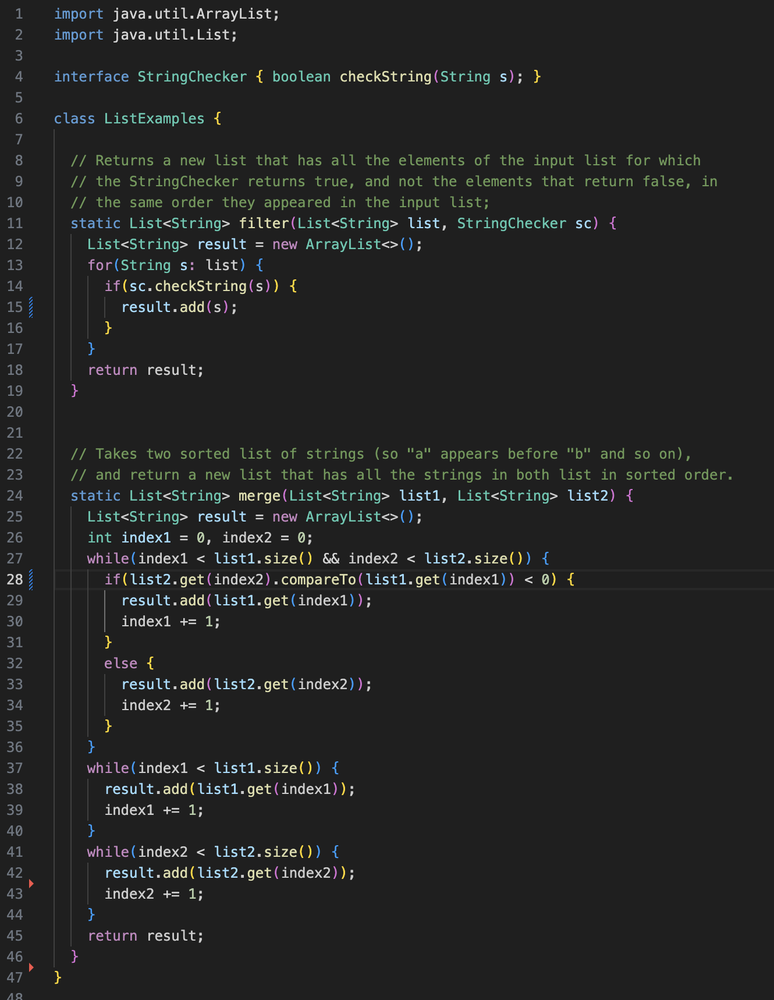
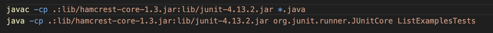
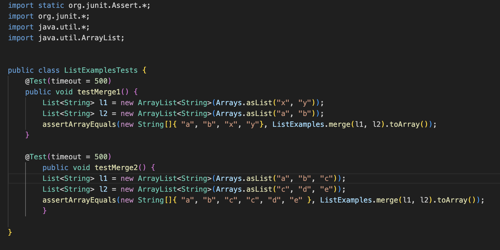
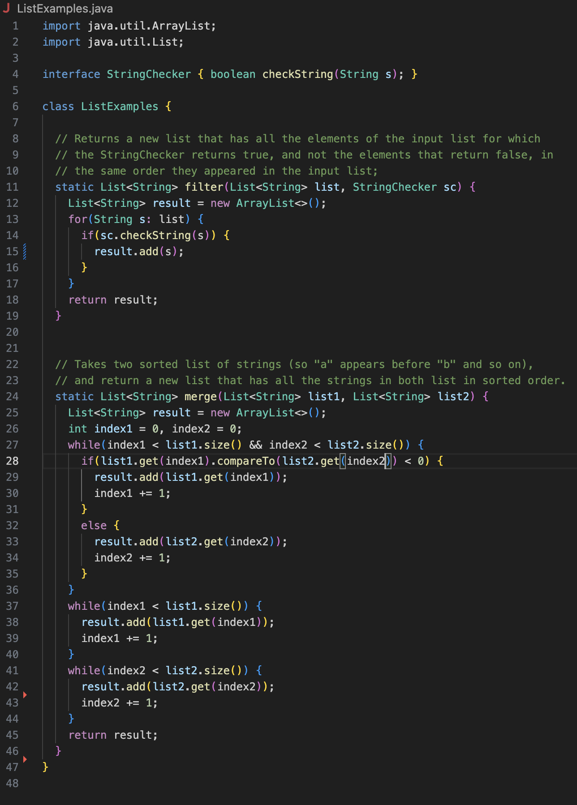

# Lab Report 5

## Student Post

I'm currently trying to create a program which takes two sorted lists and merges them into
a new list that has all elements of both list in sorted order. I'm running into an issue where
some of the new list is sorted but some of the index's hold the wrong values. I'm trying
to merge two lists which are, [x,y] and [a,b]. The new list should be [a,b,x,y] but its returning a list
that starts with x, in the initial index. Could I get some help, I'm guessing that something
is wrong with my merge function, as my grading script looks fully correct. Could I be messing up with
the logic of my code or could it be something simpler?

## Ta Response

Since the first index is already off, I would look at where the first element is being added to the new list
and see why it isn't a which you expect. You could use a debugger and set a breakpoint at each of the spots
where you add a new element, and when it hits the first one, see why it is trying to add x instead of a. There are
many reasons why this could be happening but by starting here you could see when and where exactly the issue is
happening. Hope that helps ask more questions if needed!

## Student Response

Thank you, I went through my code line by line, simulating merging the two lists and noticed that when I added
x it was because, I was comparing the wrong values. I was comparing the list2 element to the list1 element when
I should have been comparing the list1 element to the list2 element. By changing this line I fixed the code and passed
the tests. Thank you!

#### Old Code

#### New Code

#### Correct Test

## Info

### File and Directory Structure

### Contents of Files

#### ListExamples.java

#### ListExamplesTests.java

#### test.sh

#### Command To See Bug

#### How To Fix Bug

To fix the bug we have to edit line 28 in ListExamples.java, to if(list1.get(index1).compareTo(list2.get(index2)) < 0){
This fixes the code because it makes it so it compares the correct values, instead of the original code which compared it the opposite
way.

# Reflection

The most useful thing I learned was how to create my own scripts. Scripts seem very useful to use in coding, whether it be for testing
code, or automating commands that I would have to use repeatedely they save a lot of time. I have already employed them in my other class
frequently and I know I will use them in the future as well. 

